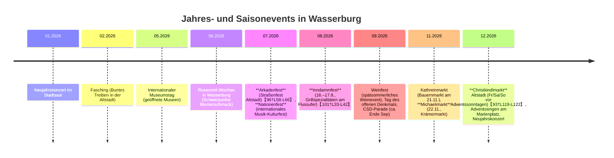

# Wasserburg am Inn – Reiseführer für Gäste

**Kurzprofil:** Wasserburg am Inn (Landkreis Rosenheim, Oberbayern) ist eine beschauliche Altstadt auf einer vom Inn-Fluss umflossenen Halbinsel (ca. 12.375 Einwohner, Stand Ende 2024【19†L229-L237】). Die verwinkelte Altstadt mit mittelalterlichem Stadtkern blieb durch fehlende Industrialisierung weitgehend erhalten【26†L36-L41】. Schon im 11. Jahrhundert erwähnt, erlangte Wasserburg im 13. Jahrhundert Reichtum durch Innschifffahrt und Salzhandel【24†L374-L382】【12†L10-L18】. 1247 fiel die Stadt an die Wittelsbacher, erhielt Stadtrecht und ihr charakteristisches Rautenwappen【24†L374-L382】. Im Zweiten Weltkrieg blieb die Stadt fast unbeschadet; seit den 1970er Jahren ist die Altstadt unter Ensembleschutz gestellt und aufwendig saniert【26†L36-L41】. Wasserburg liegt etwa 60 km östlich von München und 30 km nordwestlich von Rosenheim【36†L478-L480】. Die Höhenlage beträgt etwa 435 m über NN【6†L5-L8】. Von ihrem historisch gewachsenen Stadtrund sind zahlreiche gotische und barocke Bauwerke erhalten, allen voran das spätgotische **Rathaus** (1457 erbaut) und die barockisierte Pfarrkirche **Maria Himmelfahrt** (Frauenkirche) am Marienplatz【104†L143-L152】.

## Anreise & Verkehr

- **Bahn:** Wasserburg verfügt über den Haltepunkt *Wasserburg (Inn) Bahnhof* im Ortsteil Reitmehring (4 km westlich des Zentrums)【29†L496-L500】. Die Südostbayernbahn bedient stündlich die Linien RB48 (Richtung München) und RB44 (Richtung Rosenheim/Mühldorf)【29†L478-L481】【36†L499-L505】. Fahrgäste können mit dem Stadtbus (Linie WGB) zum Stadtzentrum weiterfahren (Abfahrt Bahnhof, abgestimmte Fahrpläne)【29†L499-L502】. Seit Dezember 2023 sind die Züge nach München in den Münchner Verkehrsverbund (MVV) integriert.

- **Auto:** Wasserburg liegt am Schnittpunkt der Bundesstraßen B 304 (München–Salzburg) und B 15 (Rosenheim–Landshut)【34†L486-L494】. Regional bietet sich die Fahrt über die Münchner A 99 und Ausfahrt *Haar* (Nr. 18) mit Beschilderung nach Wasserburg an【34†L488-L491】. Kostenlose Parkplätze finden sich am Bahnhof (Park & Ride mit E-Ladestationen)【29†L552-L559】 sowie an den Endhaltestellen der Stadtbuslinie (Bahnhof bzw. Badria-Hallenbad)【39†L630-L632】. In der Altstadt sind für Gäste mehrere Parkplatzzonen ausgewiesen (Infos im Parkplan der Stadt【38†L1-L4】).

- **Flughafen:** Am nächsten ist der Flughafen München (MUC, ca. 60 km). Salzburg Airport (SZG) ist ebenfalls ca. 80 km entfernt. Vom Münchner Flughafen erreicht man Wasserburg mit Bahn/Bus oder über die A 8/A 94 per Pkw. 

- **Öffentliche Verkehrsmittel:** Innerorts fährt ein Stadtbus (Wasserburger Verkehrsbetriebe, Liniennummer WGB) zwischen Bahnhof, Altstadt und Badria, zeitlich auf Züge abgestimmt. Ausflüge in die Umgebung z.B. mit Regionalbuslinien (z.B. Richtung Rosenheim, Grafing, Haag i.Obb.) möglich. 

- **Tourist-Info:** Die Tourist-Information am **Marienplatz 2** (im Rathaus) berät täglich Mo–Fr ca. 9:30–17:00 Uhr (Sommer) bzw. 9:30–16:00 Uhr (Winter)【1†L98-L105】【1†L107-L113】. Tel. +49 8071 105‑22, E-Mail *touristik@wasserburg.de*【1†L98-L105】. 

- **Notfälle:** Im Notfall wählen Sie europaweit **112** (Feuerwehr/Rettungsdienst) oder **110** (Polizei). Die nächstgelegene Polizeiinspektion (PI Wasserburg) ist unter Tel. +49 8071 9177‑0 erreichbar【48†L86-L92】.  Die **RoMed Klinik Wasserburg** (Chirurgie, Innere etc., Alkorstr. 4) bietet ambulante und stationäre Versorgung【45†L21-L29】; für Psychiatrie/Neurologie siehe *kbo-Inn-Salzach-Klinikum* (Gabersee, Rosenheim)【45†L39-L46】. Apotheker-Notdienst findet man über das Bayerische Apotheken-Notdienst-Portal【115†L477-L485】. Wichtige Telefonnummern: Feuerwehr/Notarzt 112, Polizei 110, Notfallapotheke siehe Internet.

- **Öffnungszeiten (Allgemein):** Geschäfte haben Mo–Fr meist ca. 09:00–18:00 (manche bis 19:00), Samstags bis 13:00 oder 16:00. Sonntags bleiben Läden grundsätzlich geschlossen (Ausnahmen: wenige Sonntagsöffnungen, Wochenmarkt jeden Mittwoch und Samstag 07:00–12:30Uhr auf dem Marienplatz). 

- **Wetter:** Wasserburg hat ein gemäßigtes Binnenklima mit warmen Sommern und kalten Wintern【50†L66-L69】. Juli-Avg: Höchst ~23–24 °C【50†L131-L134】, Januarmittel um –1 °C【50†L131-L134】. Sommer: angenehm und gelegentlich regnerisch【50†L66-L69】, Winter: kalt und häufig schneereich.

- **Sonstiges:** Bargeld-Euro ist gängig (Geldautomaten: Sparkasse, Volksbank etc.). Deutsch ist Amtssprache; in Bayern pflegt man höfliches „Sie“ und Handgeben zur Begrüßung. Trinkgeld: Rundung oder ca. 5–10% im Restaurant ist üblich. Einkauf in Tankstellen oder Supermärkten (bis 20 Uhr Mo–Sa); Apotheken: Mo–Fr 08–18, Sa 08–13. Regionen-Kultur: Bayerische Tradition wird gepflegt, Gäste sind herzlich willkommen. 

## Hotels und Unterkünfte

| Name                     | Sterne | Preisspanne (DZ)  | Entfernung Altstadt | Kontakt / Infos                         |
|--------------------------|-------:|------------------:|---------------------:|-----------------------------------------|
| Unser Hotel (Beispiel)   |   ★★★  | ca. € 90–120      | 0 km (Altstadt)      | Musterstraße 1, 83512 Wasserburg Tel. +49 8071 12345, E-Mail *info@unser-hotel.de* (fiktiv) |
| Hotel Fletzinger         |   ★★★  | ca. € 100–130     | 0 km (Altstadt)      | Fletzingergasse 3, 83512 Wasserburg Tel. +49 8071 904090【61†L193-L202】      |
| Gasthof Paulanerstuben   |   ★★★  | ca. € 80–130      | 0 km (Altstadt)      | Marienplatz 9, 83512 Wasserburg Tel. +49 8071 3903【62†L56-L59】     |
| Pfaffinger Hof (Pfaffing)| ★★★★ | ca. € 90–140      | ~8 km (Pfaffing)     | Hofgarten 7, 83539 Pfaffing Tel. +49 8071 4433【59†L12-L17】      |
| Gästehaus Sonnenschein   |   ★★   | ca. € 50–80       | 1 km                 | z.B. Grünwalder Str. 5, 83512 Wasserburg Tel. +49 8071 abcd        |

> **Hinweis:** Für unseren 3-Sterne-Haustypus („Unser Hotel“) empfehlen wir eine Buchung einige Wochen im Voraus (besonders Juli–August und Adventszeit). 

## Restaurant- und Café-Empfehlungen

Die Gastronomie reicht von bayerischen Gasthöfen über mediterrane Lokale bis zu internationalen Cafés. Viele bieten saisonale Gerichte und regionale Produkte. Hier einige Top-Adressen:

| Restaurant / Café         | Küche         | Spezialitäten / Gerichte            | Preisniveau (Hauptgericht) | Öffnungszeiten                   | Kontakt                       | Veggie/Vegan |
|---------------------------|---------------|-------------------------------------|---------------------------:|---------------------------------|-------------------------------|-------------|
| **Weißes Rössl**          | Bayerisch/gut bürgerlich | Saiblingsfilet, Kalbsbäckchen【74†L99-L104】  | €€–€€€ (15–30)            | Mi–Sa 11:30–14:00 & 18:00–21:30; So/Di Ruhetag【76†L28-L32】 | Herrengasse 1, Tel. +49 8071 5263213【76†L129-L133】 | vegetarisch, auf Anfrage |
| **Restaurant Herrenhaus** | Fine Dining / Gourmet | Degustationsmenüs mit lokalen Zutaten【74†L95-L103】 | €€€€ (à la carte ab ~€60) | Di–So abends (abends Menü, Mi–So mittags) | Herrengasse 17, Tel. +49 8071 5971170【78†L21-L24】 | Vegetarisch-Anpassung möglich |
| **Taverna Italiana**      | Italienisch   | Holzofenpizza, Pasta nach Hausrezept | €€ (ca. 8–14)            | Täglich 11:30–14:30, 17:30–22:30【80†L40-L48】 | Ledererzeile 31b, Tel. +49 8071 921446【80†L40-L48】 | viele vegetarische Gerichte |
| **Trattoria La Famiglia** | Italienisch   | Frische Pasta, Steinofenpizza       | €€ (ca. 8–15)            | Mo–Di, Fr 11:30–14:15 & 17:30–22:30; Sa–So 11:30–22:00【82†L95-L100】 | Ledererzeile 32, Tel. +49 8071 9031437【82†L104-L107】 | vegetarisch, Fisch |
| **Gasthof Fischerstüberl**| Bayerisch / Fisch | Frischer Inn-Fisch, Hauswürste     | €€ (ca. 10–18)           | Mo–Sa 11:00–23:00 (warme Küche bis 20:30)【87†L551-L560】 | Attel Elend 1, Tel. +49 8071 2598【87†L551-L556】 | wenige vegetarische Optionen |
| **Lychees**               | Asiatisch (Vietnamesisch) | Pho, Currys, Sommerrollen        | €€ (ca. 7–14)            | Di–So 11:30–14:30 & 17:30–22:30【89†L84-L92】 | Salzsenderzeile 2, Tel. +49 8071 1045757【89†L80-L89】 | viele vegetarisch/vegan |
| **Boulevard 10**          | Bistro / Gesund   | Ramen, Curry, Buddha-Bowl (vegan)  | € (ca. 8–12)             | Mi–So 09:00–18:00 (Mo/Di Ruhetag)【91†L291-L295】 | Ledererzeile 10, Tel. +49 8071 2237【91†L263-L271】 | vegan/vegetarisch |

*Reservierung:* Vor allem für Wochenenden in der Ferienzeit wird empfohlen, besonders in **Herrenhaus** oder *Gasthaus* früh zu buchen (per Telefon oder Online-Formular). Viele Restaurants bieten Online-Reservierungen auf ihren Webseiten an.

## Feste und Veranstaltungen

Wasserburg lebt vom Festkalender. Viele Aktivitäten (Konzerte, Märkte, Volksfeste) finden in der Altstadt oder auf öffentlichen Plätzen statt. Wichtige wiederkehrende Termine sind unter anderem:

- **Arkadenfest** (Mitte Juli, Altstadt): Straßenfest mit Musik, Modenschauen, Marktständen【96†L58-L66】. 
- **Nationenfest** (Mitte Juli, Marienplatz & Kirchenplatz): Multikulturelles Fest mit Folklore- und Popmusik. 
- **Inndammfest** (2. August-Hälfte, Inndamm): Grill- und Bierfest am Flußufer mit Live-Musik【101†L33-L42】. Freier Eintritt.
- **Wasserburger Weinfest** (Anfang September, Marienplatz): Präsentation regionaler Weine. 
- **Weihnachtsmarkt „Wasserburg leuchtet“** (Adventszeit, Altstadt): Handwerks- und Kulinarikstände, adventliche Musik【93†L119-L122】. 
- **Schützengau-Jubiläum, Stadtfeste, Konzerte** (jeweils wechselnde Jahresdaten) – siehe Offizielle **Veranstaltungskalender** (Stadt, Tourist-Info) für Details.  

| Event                    | Zeitpunkt                    | Ort                      | Eintritt      |
|--------------------------|-----------------------------|--------------------------|--------------:|
| Arkadenfest              | Mi–So, ca. Mitte Juli【96†L58-L66】 | Altstadt (Marienplatz)  | frei         |
| Nationenfest             | Sa/So, Mitte Juli          | Altstadt (Marktplatz)    | frei         |
| Inndammfest              | Mitte Aug (z.B. 15.8.2026)【101†L33-L42】 | Inndamm, Ufer     | frei         |
| Wasserburger Weinfest    | Anfang Sep (Wochenende)    | Marienplatz              | frei         |
| Christkindlmarkt         | Adventwochenenden (Fr–So)【93†L119-L122】 | Altstadt (Marienplatz)  | frei         |

*(Ticketinfo meist über Veranstalter-Websites; die meisten Feste sind kostenlos.)*

## Sehenswürdigkeiten & Aktivitäten

【123†embed_image】 *Bild: Die historische Innbrücke und das alte Brucktor verbinden die Altstadt-Insel mit dem Festland (Foto: Flocci Nivis, CC BY 4.0).*  

- **Altstadt & Bauwerke:** Der Hauptplatz *Marienplatz* mit dem prunkvollen Rathaus (gotisch, 15. Jh.) ist Zentrum. Weitere Highlights sind die **Frauenkirche St. Maria** mit barockem Interieur【104†L143-L152】, die Kernhaus-Rocaille-Fassade (Pfarrgasse) sowie das **Brucktor** und die mittelalterlichen Stadtmauern. Kurios: Die **Totentanzkapelle St. Ägidius** (Friedhof am Rande der Altstadt) zeigt 96 kostümierte Totenschädel. 

- **Museen:** Das **Städtische Museum Wasserburg** (Herrengasse 15) zeigt die Lokalgeschichte von der Urzeit bis 1900. Geöffnet Di–So 13–17 Uhr (Winter bis 16 Uhr)【103†L100-L107】, Eintritt ~€3,50. Auch das **Wegmachermuseum** (Herderstraße 1) thematisiert die Geschichte des Straßenbaus. 

- **Badria Bad & Wellness:** Moderne Bäder- und Saunalandschaft (Alkorstr. 14) mit Innen-/Außenbecken und langen Wasserrutschen【105†L93-L100】. Ganzjährig geöffnet, ideal für Familien und aktive Gäste. 

- **Spaziergänge und Radtouren:** Die Umgebung lädt zu Wander- und Radtouren ein【106†L95-L104】. Besonders reizvoll ist der **Skulpturenweg** entlang des Inndamms (ca. 1,5 km Rundweg, Kunstinstallationen in der Landschaft)【106†L114-L123】. Empfohlen sind auch Radwege „Innradweg“ oder „Isar-Inn-Panoramaweg“, die durch Voralpenlandschaft führen【106†L93-L102】. Für Pilger: der Jakobsweg nach Salzburg passiert Wasserburg. 

- **Tagesausflüge:** In der Nähe liegen Schloss Amerang (Burghof-Konzerte), der Chiemsee (Segeln, Herreninsel), sowie München (~1 Std mit Zug). Aktive können im Fünfseenland oder am Wendelstein wandern.  

## Nützliche Hinweise

- **Sprache & Umgang:** Im Alltag wird Hochdeutsch gesprochen, bayerischer Dialekt ist allgegenwärtig. Man duzt sich in lockeren Kreisen, wahlweise kann man sich aber auch gern nach vorheriger Erlaubnis duzen. Eine höfliche Anrede („Sie“) ist grundsätzlich angebracht, besonders gegenüber Älteren. 

- **Trinkgeld:** In Gastronomie-Restaurants üblich ist eine kleine Aufrundung oder etwa 5–10% des Rechnungsbetrags, bei sehr guter Bedienung auch mehr. Taxifahrten: ähnlich rund aufgerundet. 

- **Einkaufen:** Supermärkte (Edeka, Lidl etc.) haben Mo–Sa größtenteils bis 20 Uhr geöffnet. Die kleinen Läden am Marienplatz schließen meist 17–18 Uhr. Sonntags sind die Geschäfte geschlossen (Ausnahme: Sonntagsbrunch im Badria). 

- **Geld / Kartenzahlung:** Euro-Bargeld wird überall akzeptiert. EC-/Kreditkarten werden zunehmend (Hotels, Restaurants, Supermärkte) angenommen – immer eine Bankkarte mit Pin mitbringen. Geldautomaten finden sich bei Sparkasse (Marienplatz), Volksbank und Postbank im Stadtgebiet. 

- **Ärzte & Apotheken:** Es gibt Hausärzte, Fachärzte und Zahnärzte in Wasserburg. Die **Marien-Apotheke** (Marienplatz 1) und die **St. Jakobs-Apotheke** (Ledererzeile 6) sind apothekenöffnungszeiten mit Notdienst rotierend (Notdienstinfos online)【115†L481-L489】【115†L489-L497】.  

- **Sonstiges:** Achten Sie auf lokale Speiseempfehlungen (z.B. Innfisch, Weißwürste). Feiertagsregelungen: Am 1. Mai, Pfingsten, Fronleichnam etc. gelten oft Sonderöffnungszeiten oder Veranstaltungen. Für religiöse Besucher: An kirchlichen Feiertagen sind Gottesdienste in den Kirchen möglich. 

## Reisevorschläge (Itineraries)

- **1-Tag-Familie:** Vormittag Besuch im *Städtischen Museum* (kinderfreundlich) oder auf dem Spielplatz im Lindenpark. Mittags entspanntes Bad im Badria mit großem Schwimmbereich und Rutschen【105†L93-L100】. Nachmittags Bootsfahrt auf dem Inn (Bootsverleih an der Brücke) oder Spaziergang rund um die Altstadtinsel. Abendessen im familienfreundlichen Gasthof (z.B. *Fischerstüberl*) mit regionalen Spezialitäten. 

- **1-Tag-Pärchen:** Morgens romantischer Altstadtrundgang (Rathaus, Frauenkirche, Innblick). Kaffeepause in einem Altstadtcafé (z.B. *Boulevard 10* mit veganem Angebot). Nachmittags Fahrt mit dem Ruder- oder Tretboot auf dem Inn oder Picknick an der Wasserburger Kette am Inndamm (Skulpturenweg)【106†L114-L123】. Den Abend lassen Sie bei einem Candle-Light-Dinner im Gourmet-Restaurant (*Herrenhaus* oder *Weißes Rössl*) ausklingen. 

- **1-Tag-Aktiv:** Vormittag Radtour auf dem Innradweg Richtung Achen (Rückweg per Bahn möglich). Einkehr im Biergarten am Achberg. Nachmittags Wanderung auf den *Oberen Hardt* (Aussichtsberg oberhalb Wasserburg) oder Mountainbike-Strecke durch Moränenwälder. Früher Abend in der Sauna-/Spa-Abteilung im Badria zur Regeneration【105†L93-L100】. 

- **2-Tag-Familie:** Tag 1 wie oben, Tag 2 Ausflug zum Chiemsee (ca. 20 Min. mit Pkw): Bootsfahrt zu Herren- und Fraueninsel, Klosterbesuch, Eisbaden im Chiemsee im Sommer. Alternativ Tierpark Hellabrunn (München) oder Freizeitpark Ruhpolding. 

- **2-Tag-Pärchen:** Tag 1 wie oben. Tag 2 Spaziergang an der Atteler Brücke, Halbtages-Radtour nach Pfaffing und zurück (Gesamt ~30 km). Nachmittag Wellness oder Weinverkostung im Landhotel. 

- **2-Tag-Aktiv:** Tag 1 Radtour (z.B. Innradweg rund um Wasserburg). Tag 2 anspruchsvollere Wanderung im Wendelsteingebiet oder im Kaisergebirge (Tagestour). 

- **3-Tag-Familie:** Tage wie oben ergänzen: Tagestrip München (Tierpark Hellabrunn, Deutsches Museum) oder Bauernhofbesuch (Käseproduktion) in der Region. 

- **3-Tag-Pärchen:** Fügen Sie einen Kulturtrip nach München hinzu (z.B. Residenz, Isartor), oder einen entspannten Chiemsee-Ausflug. 

- **3-Tag-Aktiv:** Längere Etappenradfahrt (z.B. München–Wasserburg), oder Klettersteigtour am Wendelstein.  

## Quellen und Links

Wir empfehlen offizielle Informationen wie das **Tourismusportal Wasserburg** und die **Stadtseite** (wasserburg.de), sowie den Fahrplan der **Südostbayernbahn**. Viele Details (Öffnungszeiten, Events, Karten) sind dort zu finden【1†L98-L105】【29†L478-L481】【105†L93-L100】. Unsere Angaben basieren auf diesen Quellen.  

